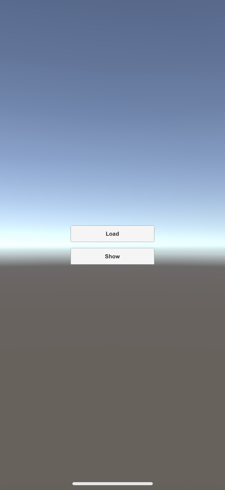

# RemoteConfig Sample For Unity.

## 環境

```
Unity: 2018.3.0f2
```

## 必要なプラグイン

すでにこのプロジェクトにpackageは含まれています。

以下参考まで

- Firebase RemoteConfig
- Google Mobile Ads
- FluctSDK

### Firebase RemoteConfig

[Unity プロジェクトに Firebase を追加する | Firebase](https://firebase.google.com/docs/unity/setup?hl=ja#set_up_environment)

上記参考の上、Firebaseのunitypackageをimportしてください。

[Firebase Remote Config for Unity を使ってみる | Firebase]()

RemoteConfigの細かい使用方法は上記のドキュメントを参照ください。

### Google Mobile Ads

[スタートガイド | Unity | Google Developers](https://developers.google.com/admob/unity/start?hl=ja)

上記のスタートガイドを確認の上、.unitypackageをimportしてください。

### FluctSDK

[voyagegroup/FluctSDK-Unity](https://github.com/voyagegroup/FluctSDK-Unity)

[Release・voyagegroup/FluctSDK-Unity](https://github.com/voyagegroup/FluctSDK-Unity/releases/latest)

上記releaseページより.unitypackageをダウンロードしてimportしてください。

[動画リワード広告の実装 · voyagegroup/FluctSDK-Unity Wiki](https://github.com/voyagegroup/FluctSDK-Unity/wiki/%E5%8B%95%E7%94%BB%E3%83%AA%E3%83%AF%E3%83%BC%E3%83%89%E5%BA%83%E5%91%8A%E3%81%AE%E5%AE%9F%E8%A3%85)

実装方法は上記を確認してください。

## サンプルプロジェクト



Loadボタンを押したら下記の処理をします。

1. RemoteConfigの初期化と情報の更新処理
2. Callbackで`reward_type`の値を受け取り、再生する動画リワードを決定する
3. `reward_type`に基づいて動画リワードの読み込み処理を開始

Showボタンを押したら下記の処理をします

1. `reward_type`に基づいて動画リワードを再生する
